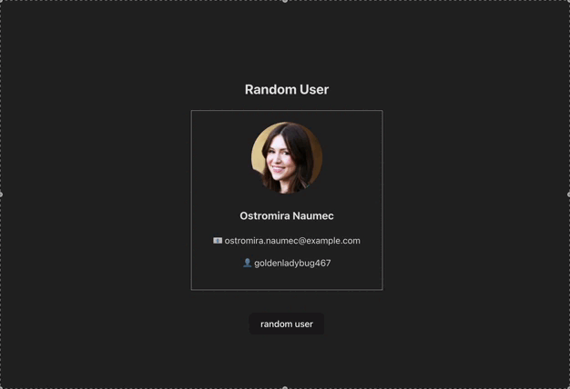

# 🎲 Random User App

This React app fetches and displays a **random user** from the [RandomUser API](https://randomuser.me/) every time the page loads or the button is clicked.

---

##  Preview



---

## ✨ Features

- Fetches a random user on initial load and on button click
- Uses `axios` for HTTP requests
- Displays user details:
  - Profile picture
  - Full name
  - Email
  - Username
- Simple and clean card layout
- Loading indicator while fetching

---

## 📁 Project Structure

```
src/
├── App.jsx             # Main entry
├── components/
│   ├── Home.jsx        # Handles fetching and state
│   └── User.jsx        # Renders the user card
├── index.css           # Global styles
└── main.jsx            # Renders App to DOM
```

---

## 🔗 API Source

Data is fetched from:

```
https://randomuser.me/api/
```

---

##  How It Works

1. On component mount (`useEffect`), fetch a user.
2. Store the response in local state using `useState`.
3. Display a user card once data is loaded.
4. Clicking the **"Random User"** button triggers a new fetch.

---

## 🛠️ Technologies Used

- ⚛️ React (Hooks)
- 🔄 Axios
- 🖼️ RandomUser API
- 🎨 CSS

---

## 🚀 Getting Started

```bash
# Clone the repository
git clone https://github.com/Shuaa-99/Random-User-App.git
cd random-user-app

# Install dependencies
npm install

# Start development server
npm run dev
# or
npm start
```

Then open: [http://localhost:3000](http://localhost:3000)

---

## 📌 Notes

- The loading state is handled with a simple conditional render.
- Easy to extend for more fields (location, gender, age, etc.).

---

## 📷 Example Avatar

Images are fetched directly from the API response:

```js
user.picture.large
```

